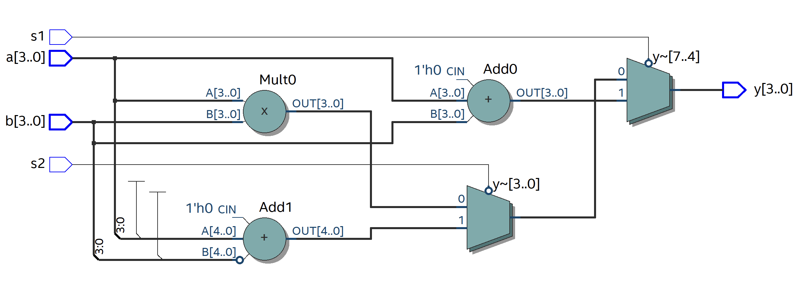

# Viết các trường hợp If Else/Switch case

## 1) Spec:
- Yêu cầu: tự nghĩ trường hợp
EX:
``` verilog
if s1 = 0
    y = a + b
else 
    y = a - b
if s2 = 0
    y = a + b
else
    y = a - b
```

- Viết các trường hợp if else lồng nhau, không lồng nhau, có if không else,...
## 2) Thực hiện:
- if else lồng nhau
- if else không lồng
- chỉ if không else
- lồng không lồng
- không lồng trong có lồng
- switch case thay if else

Module structure:
``` vhdl
LIBRARY ieee;
USE ieee.std_logic_1164.ALL;

LIBRARY ieee;
USE ieee.std_logic_1164.ALL;
USE ieee.numeric_std.ALL;

ENTITY if_else_long_nhau IS
    PORT (
        a, b : IN INTEGER RANGE -8 TO 7;
        s1, s2 : IN STD_LOGIC;
        y : OUT INTEGER RANGE -8 TO 7
    );
END ENTITY;

ARCHITECTURE rtl OF if_else_long_nhau IS
BEGIN
    processCheck : PROCESS (a, b, s1, s2)
    BEGIN
        -- IMPLEMENT HERE
        -- IMPLEMENT HERE
        -- IMPLEMENT HERE
    END PROCESS;
END ARCHITECTURE;
```
### 2.1. if else thông thường:
``` vhdl
IF (s1 = '0') THEN
    y <= a + b;
ELSIF (s2 = '0') THEN
    y <= a - b;
ELSE
    y <= a * b;
END IF;
```


Total logic elements: 28

## 3) Nhận xét:
-
-
-