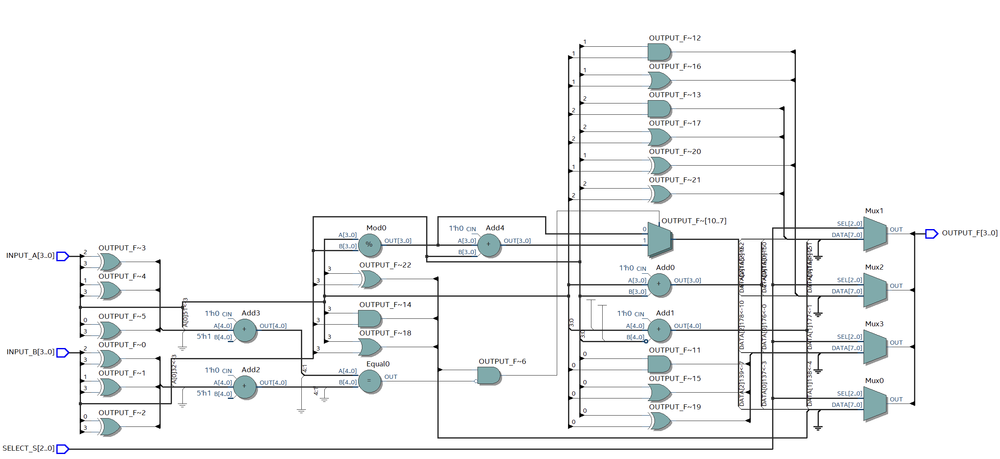

# Viết các trường hợp If Else/Switch case

## 1) Spec:
- Yêu cầu: tự nghĩ trường hợp cho một bài toán nào đó. EX:
``` verilog
if s1 = 0
    y = a + b
else 
    y = a - b
if s2 = 0
    y = a + b
else
    y = a - b
```

- Viết các trường hợp if else lồng nhau, không lồng nhau, có if không else,...
## 2) Thực hiện:
### 2.1. Bài toán đặt ra
- Thiết kế ALU tự chế, thực hiện các chức năng tính toán số học, logic dựa trên opcode được đưa vào các chân <b>Select[2:0]</b>:
  <table>
    <tbody>
        <tr>
            <td>S1S0 \ S2</td>
            <td>0</td>
            <td>1</td>
        </tr>
        <tr>
            <td>00</td>
            <td>ADD</td>
            <td>AND</td>
        </tr>
        <tr>
            <td>01</td>
            <td>SUB</td>
            <td>OR</td>
        </tr>
        <tr>
            <td>10</td>
            <td>MOD</td>
            <td>X</td>
        </tr>
        <tr>
            <td>11</td>
            <td>X</td>
            <td>XOR</td>
        </tr>
    </tbody>
  </table>
- Chi tiết:
    - Đầu vào:
      - <b>INPUT_A</b> (4 bit) và <b>INPUT_B</b> (4 bit): Mỗi cụm sẽ biểu diễn cho một số nguyên có dấu với khoảng giá trị từ -8 đến 7 hoặc dãy 4 bit tuỳ vào chế độ tính toán số học hay logic.
      - <b>SELLECT_S</b> (3 bit): Chọn phép toán dựa trên opcode đưa vào S, S2 = 0 sẽ thực hiện phép toán số học, S2 = 1 sẽ thực hiện phép toán logic. S1S0 sẽ lựa chọn 1 phép toán \$ để thực hiện A \$ B.
    - Đầu ra:
      - <b>OUTPUT_F</b> (4 bit): Cụm biểu diễn một số nguyên có dấu với khoảng giá trị từ -8 đến 7 hoặc dãy 4 bit tuỳ vào chế độ tính toán số học hay logic.
- Các trường hợp thiết kế:
  - if else
  - if else lồng nhau, vòng ngoài SELECT_S(1 DOWNTO 0), vòng trong SELECT_S(2)
  - if else lồng nhau, vòng ngoài SELECT_S(2), vòng trong SELECT_S(1 DOWNTO 0)
  - case
  - case SELECT_S(1 DOWNTO 0) lồng if else SELECT_S(2)
  - case SELECT_S(2) lồng if else SELECT_S(1 DOWNTO 0)
### 2.2. Thiết kế khung module
#### 2.2.1. Module structure:
``` VHDL
LIBRARY ieee;
USE ieee.std_logic_1164.ALL;
USE ieee.numeric_std.ALL;
--  ┌─────────┬─────────┬─────────┐
--  │S1S0 / S2│    0    │    1    │
--  ├─────────┼─────────┼─────────┤
--  │   00    │   ADD   │   AND   │
--  ├─────────┼─────────┼─────────┤
--  │   01    │   SUB   │   OR    │
--  ├─────────┼─────────┼─────────┤
--  │   10    │   MOD   │    X    │
--  ├─────────┼─────────┼─────────┤
--  │   11    │    X    │   XOR   │
--  └─────────┴─────────┴─────────┘
ENTITY ALU IS
    GENERIC (
        NUMBER_OF_INPUT_BIT : POSITIVE := 4
    );
    PORT (
        INPUT_A, INPUT_B : IN STD_LOGIC_VECTOR(NUMBER_OF_INPUT_BIT - 1 DOWNTO 0);
        SELECT_S : IN STD_LOGIC_VECTOR(2 DOWNTO 0);
        OUTPUT_F : OUT STD_LOGIC_VECTOR(NUMBER_OF_INPUT_BIT * 2 - 1 DOWNTO 0)
    );
END ENTITY;

ARCHITECTURE rtl OF ALU IS
BEGIN
    processALU : PROCESS (INPUT_A, INPUT_B, SELECT_S)
    BEGIN
        -- IMPLEMENT HERE
        -- IMPLEMENT HERE
        -- IMPLEMENT HERE
    END PROCESS;
END ARCHITECTURE;
```
Với các trường hợp thiết kế, chỉ cần thực hiện thay đổi trong phạm vi
``` VHDL
-- IMPLEMENT HERE
-- IMPLEMENT HERE
-- IMPLEMENT HERE
```
#### 2.2.2. Module test
``` VHDL
LIBRARY ieee;
USE ieee.std_logic_1164.ALL;
USE ieee.numeric_std.ALL;

ENTITY ALU_tb IS
    GENERIC (
        NUMBER_OF_BIT : POSITIVE := 4
    );
END ENTITY;

ARCHITECTURE rtl OF ALU_tb IS
    SIGNAL INPUT_A, INPUT_B : STD_LOGIC_VECTOR(NUMBER_OF_BIT - 1 DOWNTO 0);
    SIGNAL SELECT_S : STD_LOGIC_VECTOR(2 DOWNTO 0);
    SIGNAL OUTPUT_F : STD_LOGIC_VECTOR(NUMBER_OF_BIT - 1 DOWNTO 0);
    CONSTANT CLK_PERIOD : TIME := 10 ns;
BEGIN
    alu_inst : ENTITY work.ALU -- <== CHANGE THIS 'ALU' FOR TESTING
        GENERIC MAP(
            NUMBER_OF_BIT => NUMBER_OF_BIT
        )
        PORT MAP(
            INPUT_A => INPUT_A,
            INPUT_B => INPUT_B,
            SELECT_S => SELECT_S,
            OUTPUT_F => OUTPUT_F
        );
    processTest : PROCESS
    BEGIN
        INPUT_A <= "0100";
        INPUT_B <= "1101";
        loopTest : FOR select_value IN 0 TO 7 LOOP
            SELECT_S <= STD_LOGIC_VECTOR(to_unsigned(select_value, SELECT_S'length));
            WAIT FOR CLK_PERIOD;
        END LOOP;
        WAIT;
    END PROCESS;
END ARCHITECTURE;
```
Test expected:
``` VHDL
INPUT_A = 0100 (4)
INPUT_B = 1101 (-3)
SELECT_S =
000 => OUTPUT_F = INPUT_A ADD INPUT_B = 0001 (1)
001 => OUTPUT_F = INPUT_A SUB INPUT_B = 0111 (7)
010 => OUTPUT_F = INPUT_A MOD INPUT_B = 1110 (-2)
011 => OUTPUT_F = X

100 => OUTPUT_F = INPUT_A AND INPUT_B = 0100
101 => OUTPUT_F = INPUT_A OR INPUT_B = 1101
110 => OUTPUT_F = X
111 => OUTPUT_F = INPUT_A XOR INPUT_B = 1001
```

### 2.3. Implement các trường hợp thiết kế:
#### 2.3.1. If else
##### a) If else thông thường:
``` VHDL
IF SELECT_S = "000" THEN
    OUTPUT_F <= STD_LOGIC_VECTOR(signed(INPUT_A) + signed(INPUT_B));
ELSIF SELECT_S = "001" THEN
    OUTPUT_F <= STD_LOGIC_VECTOR(signed(INPUT_A) - signed(INPUT_B));
ELSIF SELECT_S = "010" THEN
    OUTPUT_F <= STD_LOGIC_VECTOR(signed(INPUT_A) MOD signed(INPUT_B));
ELSIF SELECT_S = "100" THEN
    OUTPUT_F <= INPUT_A AND INPUT_B;
ELSIF SELECT_S = "101" THEN
    OUTPUT_F <= INPUT_A OR INPUT_B;
ELSIF SELECT_S = "111" THEN
    OUTPUT_F <= INPUT_A XOR INPUT_B;
ELSE
    OUTPUT_F <= (OTHERS => 'X');
END IF;
```


Total logic elements: 74


Test chính xác

##### b) Nested If else theo SELECT_S(1 DOWNTO 0)
``` VHDL
IF SELECT_S(1 DOWNTO 0) = "00" THEN
    IF SELECT_S(2) = '0' THEN
        OUTPUT_F <= STD_LOGIC_VECTOR(signed(INPUT_A) + signed(INPUT_B));
    ELSE
        OUTPUT_F <= INPUT_A AND INPUT_B;
    END IF;
ELSIF SELECT_S(1 DOWNTO 0) = "01" THEN
    IF SELECT_S(2) = '0' THEN
        OUTPUT_F <= STD_LOGIC_VECTOR(signed(INPUT_A) - signed(INPUT_B));
    ELSE
        OUTPUT_F <= INPUT_A OR INPUT_B;
    END IF;
ELSIF SELECT_S(1 DOWNTO 0) = "10" THEN
    IF SELECT_S(2) = '0' THEN
        OUTPUT_F <= STD_LOGIC_VECTOR(signed(INPUT_A) MOD signed(INPUT_B));
    ELSE
        OUTPUT_F <= (OTHERS => 'X');
    END IF;
ELSIF SELECT_S(1 DOWNTO 0) = "11" THEN
    IF SELECT_S(2) = '0' THEN
        OUTPUT_F <= (OTHERS => 'X');
    ELSE
        OUTPUT_F <= INPUT_A XOR INPUT_B;
    END IF;
ELSE
    OUTPUT_F <= (OTHERS => 'X');
END IF;
```


Total logic elements: 78


Test chính xác

##### c) Nested If else theo SELECT_S(2)
``` VHDL
IF SELECT_S(2) = '0' THEN
    IF SELECT_S(1 DOWNTO 0) = "00" THEN
        OUTPUT_F <= STD_LOGIC_VECTOR(signed(INPUT_A) + signed(INPUT_B));
    ELSIF SELECT_S(1 DOWNTO 0) = "01" THEN
        OUTPUT_F <= STD_LOGIC_VECTOR(signed(INPUT_A) + signed(INPUT_B));
    ELSIF SELECT_S(1 DOWNTO 0) = "10" THEN
        OUTPUT_F <= STD_LOGIC_VECTOR(signed(INPUT_A) MOD signed(INPUT_B));
    ELSE
        OUTPUT_F <= (OTHERS => 'X');
    END IF;
ELSIF SELECT_S(2) = '1' THEN
    IF SELECT_S(1 DOWNTO 0) = "00" THEN
        OUTPUT_F <= INPUT_A AND INPUT_B;
    ELSIF SELECT_S(1 DOWNTO 0) = "01" THEN
        OUTPUT_F <= INPUT_A OR INPUT_B;
    ELSIF SELECT_S(1 DOWNTO 0) = "11" THEN
        OUTPUT_F <= INPUT_A XOR INPUT_B;
    ELSE
        OUTPUT_F <= (OTHERS => 'X');
    END IF;
ELSE
    OUTPUT_F <= (OTHERS => 'X');
END IF;
```


Total logic elements: 67


Test chính xác

#### 2.3.2. Case
##### a) Case thông thường:
``` VHDL
CASE SELECT_S IS
    WHEN "000" =>
        OUTPUT_F <= STD_LOGIC_VECTOR(signed(INPUT_A) + signed(INPUT_B));
    WHEN "001" =>
        OUTPUT_F <= STD_LOGIC_VECTOR(signed(INPUT_A) - signed(INPUT_B));
    WHEN "010" =>
        OUTPUT_F <= STD_LOGIC_VECTOR(signed(INPUT_A) MOD signed(INPUT_B));
    WHEN "100" =>
        OUTPUT_F <= INPUT_A AND INPUT_B;
    WHEN "101" =>
        OUTPUT_F <= INPUT_A OR INPUT_B;
    WHEN "111" =>
        OUTPUT_F <= INPUT_A XOR INPUT_B;
    WHEN OTHERS =>
        OUTPUT_F <= (OTHERS => 'X');
END CASE;
```


Total logic elements: 44


Test chính xác

##### b) Case if else theo SELECT_S(1 DOWNTO 0)
```VHDL
CASE SELECT_S(1 DOWNTO 0) IS
    WHEN "00" =>
        IF SELECT_S(2) = '0' THEN
            OUTPUT_F <= STD_LOGIC_VECTOR(signed(INPUT_A) + signed(INPUT_B));
        ELSE
            OUTPUT_F <= INPUT_A AND INPUT_B;
        END IF;
    WHEN "01" =>
        IF SELECT_S(2) = '0' THEN
            OUTPUT_F <= STD_LOGIC_VECTOR(signed(INPUT_A) - signed(INPUT_B));
        ELSE
            OUTPUT_F <= INPUT_A OR INPUT_B;
        END IF;
    WHEN "10" =>
        IF SELECT_S(2) = '0' THEN
            OUTPUT_F <= STD_LOGIC_VECTOR(signed(INPUT_A) MOD signed(INPUT_B));
        ELSE
            OUTPUT_F <= (OTHERS => 'X');
        END IF;
    WHEN "11" =>
        IF SELECT_S(2) = '0' THEN
            OUTPUT_F <= (OTHERS => 'X');
        ELSE
            OUTPUT_F <= INPUT_A XOR INPUT_B;
        END IF;
    WHEN OTHERS =>
            OUTPUT_F <= (OTHERS => 'X');
END CASE;
```

Total logic elements: 74


Test chính xác

##### c) Case if else theo SELECT_S(2)
```VHDL
CASE SELECT_S(2) IS
    WHEN '0' =>
        IF SELECT_S(1 DOWNTO 0) = "00" THEN
            OUTPUT_F <= STD_LOGIC_VECTOR(signed(INPUT_A) + signed(INPUT_B));
        ELSIF SELECT_S(1 DOWNTO 0) = "01" THEN
            OUTPUT_F <= STD_LOGIC_VECTOR(signed(INPUT_A) + signed(INPUT_B));
        ELSIF SELECT_S(1 DOWNTO 0) = "10" THEN
            OUTPUT_F <= STD_LOGIC_VECTOR(signed(INPUT_A) MOD signed(INPUT_B));
        ELSE
            OUTPUT_F <= (OTHERS => 'X');
        END IF;
    WHEN '1' =>
        IF SELECT_S(1 DOWNTO 0) = "00" THEN
            OUTPUT_F <= INPUT_A AND INPUT_B;
        ELSIF SELECT_S(1 DOWNTO 0) = "01" THEN
            OUTPUT_F <= INPUT_A OR INPUT_B;
        ELSIF SELECT_S(1 DOWNTO 0) = "11" THEN
            OUTPUT_F <= INPUT_A XOR INPUT_B;
        ELSE
            OUTPUT_F <= (OTHERS => 'X');
        END IF;
    WHEN OTHERS =>
        OUTPUT_F <= (OTHERS => 'X');
END CASE;
```

Total logic elements: 67


Test chính xác

## 3) Nhận xét:
- Với If else, mức độ ưu tiên của tín hiệu đầu ra sẽ theo từng vòng lồng ghép. Ưu tiên cao nhất với điều kiện vòng ngoài cùng. Vậy nên trong trường hợp <b>2.3.1.a) If else thông thường</b>, khối kiểm tra điều kiện if đầu tiên sẽ là bộ MUX nằm gần đầu ra nhất. Nối theo sau đó là một loạt các điều kiện theo sau và tương ứng là các bộ MUX có mức ưu tiên thấp hơn.
  ```
                               ┌┐        
                        C1 TRUE│└─┐      
                     ┌┐      ──┤  └┐     
              C2 TRUE│└─┐      │   └┐    
           ┌┐      ──┤  └┐     │    ├── F
    C3 TRUE│└─┐      │   └┐    │   ┌┘    
         ──┤  └┐     │    ├────┤  ┌┘     
           │   └┐    │   ┌┘    │┌┬┘      
           │    ├────┤  ┌┘     └┘│       
   C3 FALSE│   ┌┘    │┌┬┘        │       
         ──┤  ┌┘     └┘│         │       
           │┌┬┘        │         │       
           └┘│         │    Condition 1  
             │         │                 
             │    Condition 2            
             │                           
        Condition 3                      
  ```
- Với Case, mức độ ưu tiên là như nhau, các trường hợp When đều có vị trí đặt bộ MUX gần đầu ra, gần như tương đương với một bộ MUX lớn thay vì chia tách thành các lớp MUX nối tiếp. Có thể đối chiếu qua RTL View của trường hợp <b>2.3.2.a) Case thông thường</b>
  ```
                   ┌┐        
                   │└─┐      
          WHEN 1 ──┤  └┐     
                   │   └┐    
          WHEN 1 ──┤    │    
                   │    │    
          WHEN 1 ──┤    │    
                   │    ├── F
                 . │    │    
                 . │    │    
                 . │    │   
                   │   ┌┘    
          WHEN 1 ──┤  ┌┘     
                   │┌┬┘      
                   └┘│╱      
                     ╳       
                    ╱│       
                     │       
                Case encoder 
  ```
- Việc kết hợp sử dụng If else, Case cũng cần lưu ý tới mức độ phức tạp của mạch, đôi khi có những trường hợp không thể sử lý tối ưu được logic sẽ khiến cho số lượng phần tử logic (Total logic elements - TLEs) tiêu hao nhiều hơn. Ví dụ như <b>2.3.2.a) Case thông thường</b> chỉ tốn <b style="color:red;">44 TLEs</b> do xử lý tối ưu được logic bài toán đã đặt ra, trong khi <b>2.3.1.b) Nested If else theo SELECT_S(1 DOWNTO 0)</b> tốn tới <b style="color:red;">78 TLEs</b> do việc xử lý lặp lại một số trường hợp logic bên trong vòng lồng ghép if else, dẫn tới dư thừa phần tử logic trong mạch.