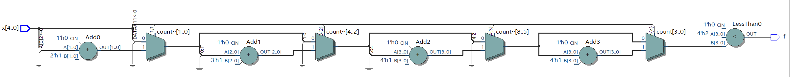

# Mạch số lớn (Majority)

## 1) Spec:

## 2) Thực hiện:
### 2.1. Code
- Top module majority
``` vhdl
LIBRARY ieee;
USE ieee.std_logic_1164.ALL;

ENTITY majority IS
    GENERIC (
        NUMBER_OF_BITS : NATURAL := 3
    );
    PORT (
        x : IN STD_LOGIC_VECTOR(NUMBER_OF_BITS - 1 DOWNTO 0);
        f : OUT STD_LOGIC
    );
END ENTITY;

ARCHITECTURE rtl OF majority IS
BEGIN
    PROCESS (x)
        VARIABLE count : NATURAL RANGE 0 TO 8;
    BEGIN
        count := 0;
        loopCount : FOR bit_index IN 0 TO NUMBER_OF_BITS - 1 LOOP
            IF (x(bit_index) = '1') THEN
                count := count + 1;
            END IF;
        END LOOP;
        IF count > NUMBER_OF_BITS / 2 THEN
            f <= '1';
        ELSE
            f <= '0';
        END IF;
    END PROCESS;
END ARCHITECTURE;
```
- Testbench
``` vhdl
LIBRARY ieee;
USE ieee.std_logic_1164.ALL;
USE ieee.numeric_std.ALL;

ENTITY majority_tb IS
    GENERIC (
        NUMBER_OF_BITS : POSITIVE := 5
    );
END ENTITY;

ARCHITECTURE rtl OF majority_tb IS
    SIGNAL x : STD_LOGIC_VECTOR(NUMBER_OF_BITS - 1 DOWNTO 0);
    SIGNAL f : STD_LOGIC;
    CONSTANT CLK_PERIOD : TIME := 10 ns;
BEGIN
    majority_inst : ENTITY work.majority
        GENERIC MAP(
            NUMBER_OF_BITS => NUMBER_OF_BITS
        )
        PORT MAP(
            x => x,
            f => f
        );
    processTest : PROCESS
    BEGIN
        loopTest : FOR x_value IN 0 TO 2 ** NUMBER_OF_BITS - 1 LOOP
            x <= STD_LOGIC_VECTOR(to_unsigned(x_value, x'length));
            WAIT FOR CLK_PERIOD;
        END LOOP;
        WAIT;
    END PROCESS;
END ARCHITECTURE;
```
## 2.2. Demo
- RTL view:
    - Số lượng bit đầu vào (NUMBER_OF_BITS) = 3:
    
    Total logic elements: 1
    - Số lượng bit đầu vào (NUMBER_OF_BITS) = 5:
    
    Total logic elements: 3
- Simulation:
    - Test với số lượng bit đầu vào (NUMBER_OF_BITS) = 3:
    
    - Test với số lượng bit đầu vào (NUMBER_OF_BITS) = 5:
    