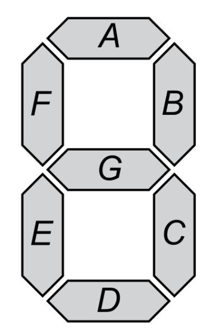
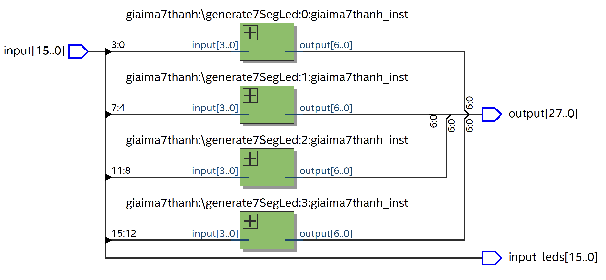
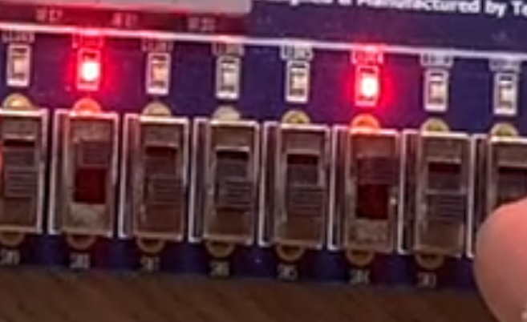

<h1 style="text-align:center; color:red;">MẠCH GIẢI MÃ 7 THANH TRÊN FPGA</h1>


## 1) SPEC:

### Inputs:
- Số lượng: 16 bits chia 4 cụm, mỗi cụm 4 bit.
- Ý nghĩa: Mỗi cụm tương ứng với giá trị Dec 0-15 (Hex 0-F).
### Outputs:
- Số lượng: 28 bits chia 4 cụm, mỗi cụm 7 bit.
- Ý nghĩa: Mỗi cụm tương ứng với tổ hợp điều khiển 7 thanh sáng của led 7 đoạn.

## 2) Yêu cầu & thực hiện
### 2.1. Vẽ bảng chân lý


Theo datasheet (<a href="https://www.alldatasheet.com/datasheet-pdf/pdf/487677/ALTERA/DE2-115.html">>> link</a>), led 7 đoạn trên target board (DE2-115) được mắc theo kiểu Sink dòng. Để bật sáng thanh led ta cần điều khiển pin tương ứng xuất tín hiệu logic 0, để tắt đi thì điều khiển tín hiệu logic 1.
<table style="text-align:center;">
    <thead>
        <tr>
            <th>abcd</th>
            <th>GFEDCBA</th>
            <th>abcd</th>
            <th>GFEDCBA</th>
            <th>abcd</th>
            <th>GFEDCBA</th>
            <th>abcd</th>
            <th>GFEDCBA</th>
        </tr>
    </thead>
    <tbody>
        <tr>
            <td>0000</td>
            <td>1000000</td>
            <td>0100</td>
            <td>0011001</td>
            <td>1000</td>
            <td>0000000</td>
            <td>1100</td>
            <td>1000110</td>
        </tr>
        <tr>
            <td>0001</td>
            <td>1111001</td>
            <td>0101</td>
            <td>0010010</td>
            <td>1001</td>
            <td>0010000</td>
            <td>1101</td>
            <td>0100001</td>
        </tr>
        <tr>
            <td>0010</td>
            <td>0100100</td>
            <td>0110</td>
            <td>0000010</td>
            <td>1010</td>
            <td>0001000</td>
            <td>1110</td>
            <td>0000110</td>
        </tr>
        <tr>
            <td>0011</td>
            <td>0110000</td>
            <td>0111</td>
            <td>1111000</td>
            <td>1011</td>
            <td>0000011</td>
            <td>1111</td>
            <td>0001110</td>
        </tr>
    </tbody>
</table>

### 2.2. Vẽ tổng thể hệ thống

Ngoài các inputs, outputs như đã đề cập, tôi bổ sung thêm output để điều khiển bóng đèn led tương ứng với trạng thái của các đầu vào. Với việc bổ sung này sẽ giúp việc tương tác với FPGA board trở lên trực quan hơn khi trạng thái của dữ liệu được hiển thị trực tiếp.
<br>


### 2.3. Code
- Module <b>giaima7thanh</b>:
``` verilog
LIBRARY ieee;
USE ieee.std_logic_1164.ALL;
USE ieee.numeric_std.ALL;

ENTITY giaima7thanh IS
    PORT (
        input : IN STD_LOGIC_VECTOR(3 DOWNTO 0); -- abcd
        output : OUT STD_LOGIC_VECTOR(6 DOWNTO 0) -- GFEDCBA
    );
END ENTITY;

ARCHITECTURE rtl OF giaima7thanh IS
BEGIN
    processGiaiMa : PROCESS (input)
    BEGIN
        CASE (input) IS
            WHEN "0000" =>
                output <= "1000000";
            WHEN "0001" =>
                output <= "1111001";
            WHEN "0010" =>
                output <= "0100100";
            WHEN "0011" =>
                output <= "0110000";
            WHEN "0100" =>
                output <= "0011001";
            WHEN "0101" =>
                output <= "0010010";
            WHEN "0110" =>
                output <= "0000010";
            WHEN "0111" =>
                output <= "1111000";
            WHEN "1000" =>
                output <= "0000000";
            WHEN "1001" =>
                output <= "0010000";
            WHEN "1010" =>
                output <= "0001000";
            WHEN "1011" =>
                output <= "0000011";
            WHEN "1100" =>
                output <= "1000110";
            WHEN "1101" =>
                output <= "0100001";
            WHEN "1110" =>
                output <= "0000110";
            WHEN "1111" =>
                output <= "0001110";
            WHEN OTHERS =>
                output <= (OTHERS => '0');
        END CASE;
    END PROCESS;
END ARCHITECTURE;
```
- Top module <b>giaima7thanh_topmodule</b>:
``` verilog
LIBRARY ieee;
USE ieee.std_logic_1164.ALL;
USE ieee.numeric_std.ALL;

ENTITY giaima7thanh_topmodule IS
  GENERIC (
    NUMBER_OF_LED : POSITIVE := 4
  );
  PORT (
    input : IN STD_LOGIC_VECTOR(NUMBER_OF_LED * 4 - 1 DOWNTO 0);
    input_leds : OUT STD_LOGIC_VECTOR(NUMBER_OF_LED * 4 - 1 DOWNTO 0);
    output : OUT STD_LOGIC_VECTOR(NUMBER_OF_LED * 7 - 1 DOWNTO 0)
  );
END ENTITY;

ARCHITECTURE rtl OF giaima7thanh_topmodule IS
BEGIN
  input_leds <= input;
  generate7SegLed : FOR led_index IN 0 TO NUMBER_OF_LED - 1 GENERATE
    giaima7thanh_inst : ENTITY work.giaima7thanh
      PORT MAP(
        input => input((led_index + 1) * 4 - 1 DOWNTO led_index * 4),
        output => output((led_index + 1) * 7 - 1 DOWNTO led_index * 7)
      );
  END GENERATE;
END ARCHITECTURE;
```
### 2.4. Gán các pins
Theo datasheet (<a href="https://www.alldatasheet.com/datasheet-pdf/pdf/487677/ALTERA/DE2-115.html">>> link</a>), target board có một loạt các linh kiện kèm theo để có thể tương tác. Để điều khiển các tín hiệu inputs, tôi gán lần lượt các switch tương ứng theo thứ tự điều khiển các led 7 thanh, trọng số từ cao đến thấp. Bóng đèn trạng thái của switch cũng sẽ được gán tương ứng. Điều khiển từng thanh led của các led 7 thanh thông qua việc gán outputs tương ứng.
File gán các pins như mô tả có thể được tìm thấy ở đây: <a href="./Quartus/SevenSegLed_PinAssigment.csv">>> Link</a>
### 2.5. Demo


## 3) Tổng kết
- Mạch hoạt động đúng chức năng đề ra, giải mã tín hiệu đầu vào thành ký tự tương ứng trên led 7 thanh một cách mượt mà, không có lỗi sai.
- Thông qua bài tập này tôi đã có được những kiến thức cơ bản về mô tả hệ thống số sử dụng ngôn ngữ mô tả phần cứng, nạp bitstream và thử nghiệm trên mạch thực tế được cung cấp. Ngoài ra còn được rèn luyện khả năng nghiên cứu, tìm tòi kiến thức, đặc biệt là việc đọc datasheet của target board sao cho hiệu quả.